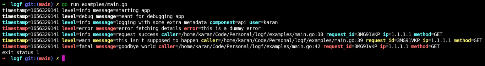

# logf

[](https://pkg.go.dev/github.com/mr-karan/logf)
[](https://goreportcard.com/report/mr-karan/logf)
[](https://github.com/mr-karan/logf/actions/workflows/build.yml)


logf is a **high performance** logging library Go applications with a **minimal** API overhead. It emits **structured logs** ([`logfmt`](https://brandur.org/logfmt) style) in human readable and machine friendly way. `logf` tries to be customisable without providing an overwhelming amount of things to configure before you start logging in your Go apps.

## Example

```go
package main

import (
	"errors"
	"time"

	"github.com/mr-karan/logf"
)

func main() {
	logger := logf.New()
	// Basic log.
	logger.Info("starting app")

	// Change verbosity on the fly.
	logger.SetLevel(logf.DebugLevel)
	logger.Debug("meant for debugging app")

	// Add extra keys to the log.
	logger.WithFields(logf.Fields{
		"component": "api",
		"user":      "karan",
	}).Info("logging with some extra metadata")

	// Log with error key.
	logger.WithError(errors.New("this is a dummy error")).Error("error fetching details")

	// Enable `caller` field in the log and specify the number of frames to skip to get the caller. 
	logger.SetCallerFrame(true, 3)
	// Change the default timestamp format.
	logger.SetTimestampFormat(time.RFC3339Nano)

	// Create a logger and add fields which will be logged in every line.
	requestLogger := logger.WithFields(logf.Fields{"request_id": "3MG91VKP", "ip": "1.1.1.1", "method": "GET"})
	requestLogger.Info("request success")
	requestLogger.Warn("this isn't supposed to happen")

	// Log the error and set exit code as 1.
	logger.Fatal("goodbye world")
}
```

### Text Output

```bash
timestamp=2022-06-26T11:56:46+05:30 level=info message=starting app caller=/home/karan/Code/Personal/logf/examples/main.go:13
timestamp=2022-06-26T11:56:46+05:30 level=debug message=meant for debugging app caller=/home/karan/Code/Personal/logf/examples/main.go:17 level=debug message=meant for debugging app timestamp=2022-06-26T11:56:46+05:30 caller=/home/karan/Code/Personal/logf/examples/main.go:17
timestamp=2022-06-26T11:56:46+05:30 level=info message=logging with some extra metadata component=api user=karan caller=/home/karan/Code/Personal/logf/examples/main.go:23
timestamp=2022-06-26T11:56:46+05:30 level=error message=error fetching details error=this is a dummy error caller=/home/karan/Code/Personal/logf/examples/main.go:26
timestamp=2022-06-26T11:56:46.412189111+05:30 level=info message=request success ip=1.1.1.1 method=GET request_id=3MG91VKP
timestamp=2022-06-26T11:56:46.412204619+05:30 level=warn message=this isn't supposed to happen ip=1.1.1.1 level=warn message=this isn't supposed to happen method=GET request_id=3MG91VKP timestamp=2022-06-26T11:56:46.412204619+05:30
timestamp=2022-06-26T11:56:46.412218628+05:30 level=fatal message=goodbye world ip=1.1.1.1 level=fatal message=goodbye world method=GET request_id=3MG91VKP timestamp=2022-06-26T11:56:46.412218628+05:30
```

### Console Output



## Why another lib

Agreed there are many logging libraries out there but I was dissatisfied with the current options.

`logf` satisfies my constraints of:

- Clean API
- Minimal Dependencies
- Structured logging but human readable (`logfmt`!)
- Sane defaults out of the box

## Benchmarks

You can run benchmarks with `make bench`.

**Note**
> Enabling color significantly affects performance. You should enable them only in scenarios where this isn't a concern (for eg single run CLI apps etc.)

### No Colors (Default)

```
BenchmarkNoField-8                       6720405               172.8 ns/op            40 B/op          3 allocs/op
BenchmarkOneField-8                      2377168               597.5 ns/op           376 B/op          5 allocs/op
BenchmarkThreeFields-8                   1951350               540.5 ns/op           384 B/op          6 allocs/op
BenchmarkThreeFields_WithCaller-8         742970              1551 ns/op             680 B/op         10 allocs/op
BenchmarkErrorField-8                    2714325               442.5 ns/op           392 B/op          6 allocs/op
BenchmarkHugePayload-8                    531368              2151 ns/op            1427 B/op         17 allocs/op
```

### With Colors

```
BenchmarkNoField_WithColor-8              398384              2992 ns/op            1200 B/op         66 allocs/op
BenchmarkOneField_WithColor-8             227470              5106 ns/op            2320 B/op        110 allocs/op
BenchmarkThreeFields_WithColor-8          120404              9819 ns/op            3921 B/op        195 allocs/op
BenchmarkHugePayload_WithColor-8           45508             25975 ns/op           11344 B/op        542 allocs/op
BenchmarkErrorField_WithColor-8           237148              5357 ns/op            2336 B/op        111 allocs/op
```

For a comparison with existing popular libs, visit [uber-go/zap#performance](https://github.com/uber-go/zap#performance).

## Contributors

- [Sarat](https://github.com/iamd3vil/)

## LICENSE

[LICENSE](./LICENSE)
