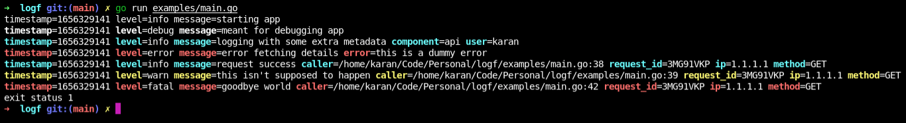

<a href="https://zerodha.tech"></a>

# 💥 logf

[](https://pkg.go.dev/github.com/zerodha/logf)
[](https://goreportcard.com/report/zerodha/logf)
[](https://github.com/zerodha/logf/actions/workflows/build.yml)

`logf` is a high-performance, zero-alloc logging library for Go applications with a minimal API overhead. It's also the fastest logfmt logging library for Go.

`logf` emits structured logs in [`logfmt`](https://brandur.org/logfmt) style. `logfmt` is a flexible format that involves `key=value` pairs to emit structured log lines. `logfmt` achieves the goal of generating logs that are not just machine-friendly but also readable by humans, unlike the clunky JSON lines.

## Example

```go
package main

import (
	"time"

	"github.com/zerodha/logf"
)

func main() {
	logger := logf.New(logf.Opts{
		EnableColor:          true,
		Level:                logf.DebugLevel,
		CallerSkipFrameCount: 3,
		EnableCaller:         true,
		TimestampFormat:      time.RFC3339Nano,
		DefaultFields:        []any{"scope", "example"},
	})

	// Basic logs.
	logger.Info("starting app")
	logger.Debug("meant for debugging app")

	// Add extra keys to the log.
	logger.Info("logging with some extra metadata", "component", "api", "user", "karan")

	// Log with error key.
	logger.Error("error fetching details", "error", "this is a dummy error")

	// Log the error and set exit code as 1.
	logger.Fatal("goodbye world")
}
```

### Text Output

```bash
timestamp=2022-07-07T12:09:10.221+05:30 level=info message="starting app"
timestamp=2022-07-07T12:09:10.221+05:30 level=info message="logging with some extra metadata" component=api user=karan
timestamp=2022-07-07T12:09:10.221+05:30 level=error message="error fetching details" error="this is a dummy error"
timestamp=2022-07-07T12:09:10.221+05:30 level=fatal message="goodbye world"
```

### Console Output



## Slog Adapter

`logf` provides a `slog.Handler` implementation, allowing you to use `logf` as a backend for Go's standard `log/slog` package. This gives you the best of both worlds: the familiar `slog` API with `logf`'s efficient logfmt output.

```go
package main

import (
	"errors"
	"log/slog"
	"time"

	"github.com/zerodha/logf"
)

func main() {
	// Create a logf logger.
	logger := logf.New(logf.Opts{
		EnableColor:     true,
		Level:           logf.DebugLevel,
		TimestampFormat: time.RFC3339Nano,
	})

	// Create a slog handler using logf.
	handler := logf.NewSlogHandler(logger)

	// Create a slog.Logger.
	slogger := slog.New(handler)

	// Use standard slog API.
	slogger.Info("user logged in", "user_id", 12345, "username", "johndoe")

	// Typed attributes.
	slogger.Info("request completed",
		slog.String("method", "GET"),
		slog.Int("status", 200),
		slog.Duration("latency", 150*time.Millisecond),
	)

	// Groups.
	slogger.Info("http request",
		slog.Group("request",
			slog.String("method", "POST"),
			slog.String("path", "/api/users"),
		),
	)

	// WithAttrs for persistent fields.
	requestLogger := slog.New(handler.WithAttrs([]slog.Attr{
		slog.String("request_id", "abc-123"),
	}))
	requestLogger.Info("processing request")

	// WithGroup for namespaced logging.
	dbLogger := slog.New(handler.WithGroup("database"))
	dbLogger.Info("query executed", "rows", 42)

	// Error logging.
	err := errors.New("connection timeout")
	slogger.Error("database error", "error", err)
}
```

**Output:**
```
timestamp=2024-01-15T10:30:00.000Z level=info message="user logged in" user_id=12345 username=johndoe
timestamp=2024-01-15T10:30:00.000Z level=info message="request completed" method=GET status=200 latency=150ms
timestamp=2024-01-15T10:30:00.000Z level=info message="http request" request.method=POST request.path=/api/users
timestamp=2024-01-15T10:30:00.000Z level=info message="processing request" request_id=abc-123
timestamp=2024-01-15T10:30:00.000Z level=info message="query executed" database.rows=42
timestamp=2024-01-15T10:30:00.000Z level=error message="database error" error="connection timeout"
```

## Why another lib

There are several logging libraries, but the available options didn't meet our use case.

`logf` meets our constraints of:

- Clean API
- Minimal dependencies
- Structured logging but human-readable (`logfmt`!)
- Sane defaults out of the box

## Benchmarks

You can run benchmarks with `make bench`.

### Logf Direct (zero allocations)

```
BenchmarkNoField-20                       1801494               660.7 ns/op             0 B/op          0 allocs/op
BenchmarkOneField-20                      1734037               695.6 ns/op             0 B/op          0 allocs/op
BenchmarkThreeFields-20                   1815223               616.4 ns/op             0 B/op          0 allocs/op
BenchmarkErrorField-20                    1700761               679.6 ns/op             0 B/op          0 allocs/op
BenchmarkHugePayload-20                   1360930               857.8 ns/op             0 B/op          0 allocs/op
BenchmarkThreeFields_WithCaller-20        1611195               799.6 ns/op           248 B/op          2 allocs/op
```

### Slog Handler Comparison

| Benchmark | logf slog | slog JSON | slog Text |
|-----------|-----------|-----------|-----------|
| NoField | 647 ns/op, 0 allocs | 567 ns/op, 0 allocs | 690 ns/op, 0 allocs |
| OneField | 650 ns/op, 0 allocs | 741 ns/op, 0 allocs | - |
| ThreeFields | 686 ns/op, 1 allocs | 816 ns/op, 0 allocs | 785 ns/op, 0 allocs |
| HugePayload | 932 ns/op, 3 allocs | 1079 ns/op, 7 allocs | 537 ns/op, 1 allocs |
| Disabled | **0.8 ns/op, 0 allocs** | - | - |

The logf slog handler provides competitive performance with vanilla slog handlers while outputting human-readable logfmt format. When logs are disabled, the handler short-circuits in sub-nanosecond time.

For a comparison with existing popular libs, visit [uber-go/zap#performance](https://github.com/uber-go/zap#performance).

## LICENSE

[LICENSE](./LICENSE)
